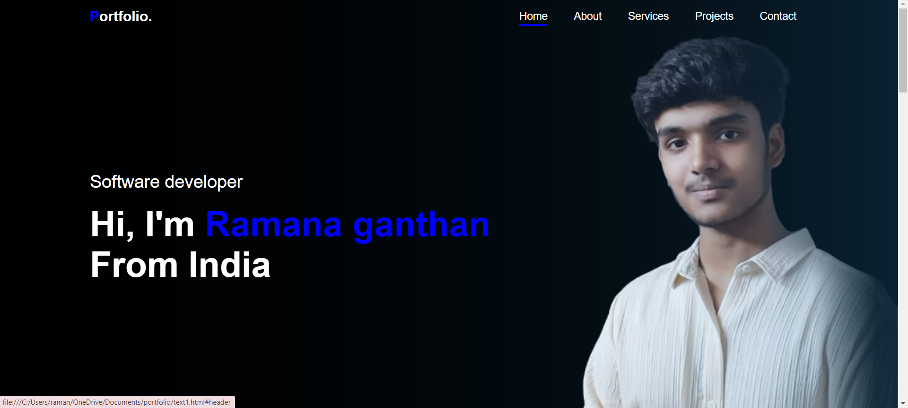
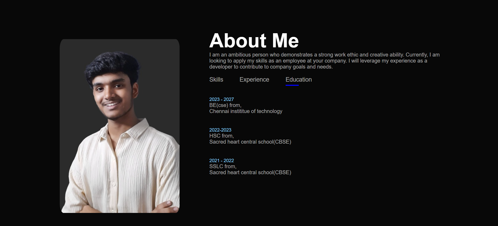
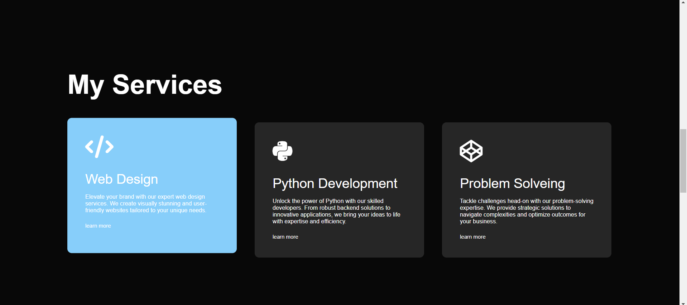
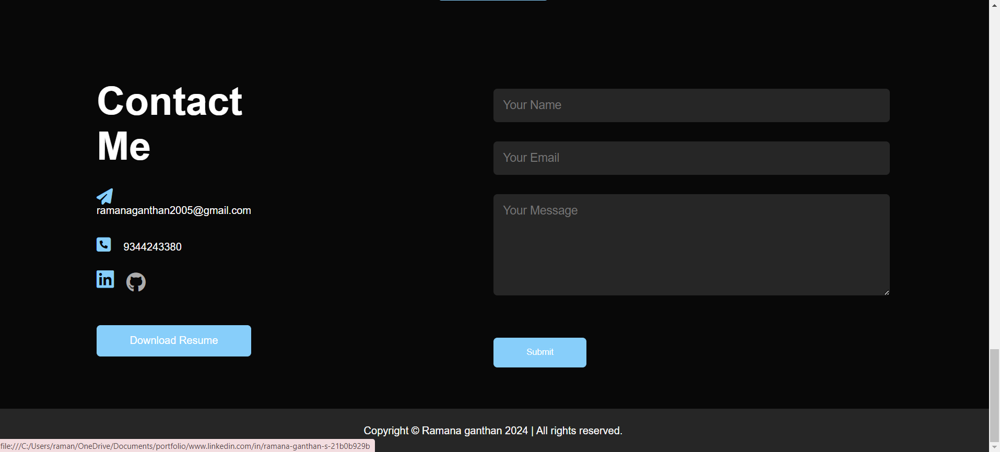
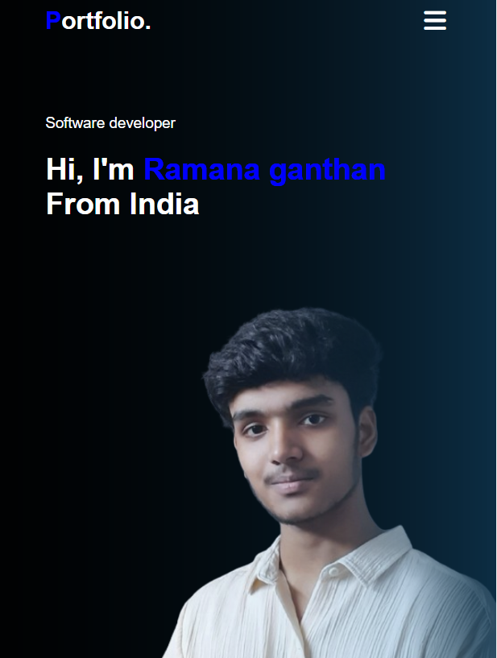

<h1>Description </h1>

🚀 Welcome to my portfolio! 🎨 Explore my creative journey on a website that's fully responsive, ensuring a seamless experience on any device – from desktops to smartphones. Dive into projects, achievements, and skills with ease. 🌐 Let's connect through design that adapts to your screen size, making it accessible and visually appealing for everyone. 📱💻✨ #ResponsiveDesign #PortfolioMagic

<h1>Screenshots</h1>
<ul>
  <li>
    <h2>On Desktop </h2>
    
    
    
    
    
  </li>
  <li>
    <h2>On Phone</h2>
    
    
  </li>
</ul>

